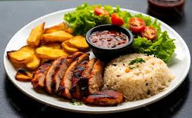

# 🥗 Agente_Nutri - Análise Inteligente da Alimentação

**Agente_Nutri** é uma aplicação Python com agentes inteligentes que analisam imagens de refeições e verificam se os alimentos identificados estão adequados ao perfil e objetivo de saúde do usuário — como emagrecimento, obesidade, sedentarismo, diabetes, entre outros.

---

## 🚀 Funcionalidades

- ✅ Detecção de alimentos a partir de imagem usando modelo multimodal.
- ✅ Geração de descrição detalhada dos alimentos.
- ✅ Avaliação nutricional baseada nas condições e objetivos do usuário.
- ✅ Geração de relatório com recomendações personalizadas.
- ✅ Interface simples para upload e retorno de resultados.

---

## 🧠 Arquitetura do Projeto

O sistema é baseado em dois agentes:

### 👁️ Agente 1 – Detecção e Descrição (Visão Computacional)
- Modelo multimodal identifica os alimentos da imagem.
- Gera uma descrição estruturada da refeição, incluindo quantidades, tipos de alimento e possíveis ingredientes.

### 🧑‍⚕️ Agente 2 – Avaliação Nutricional
- Atua como um nutricionista virtual.
- Recebe a descrição da refeição e avalia sua adequação com base nos **objetivos do usuário** (ex: emagrecer, diabetes, etc).
- Produz recomendações e um relatório com sugestões de melhoria, se necessário.

---

## 📷 Exemplo de uso

1. O usuário faz o upload desta imagem:

   

2. O modelo identifica:
   - Arroz branco
   - Feijão preto
   - File de frango
   - Salada com alface, tomate
   - Batata

3. O agente nutricionista avalia e retorna:

> **Objetivo do usuário:** Emagrecimento  
> **Recomendação:** Reduzir porção de arroz, evitar suco com açúcar, incluir uma fonte de gordura boa (como azeite na salada).

---

## ⚙️ Como usar

### 1. Clonar o repositório

```bash
git clone https://github.com/seu-usuario/agente_nutri.git
cd agente_nutri

```
### 2. Criar ambiente virtual
python -m venv venv
source venv/bin/activate  # Linux/Mac
venv\Scripts\activate     # Windows

### 3. Instalar dependências
pip install -r requirements.txt

### 4. Executar a aplicação
streamlit run app.py

### 🛠️ Tecnologias Utilizadas
Python 3.11+

Streamlit – Interface Web

Modelo Multimodal - 'meta-llama/llama-4-scout-17b-16e-instruct'
Modelo textual    - 'groq/llama-3.2-3b-preview'

CrewaAI – Orquestração de Agentes

[Pillow, Requests, etc.] – Manipulação de imagem e requisições


### 📁 Estrutura do Projeto

agente_nutri/
│
├── agents/
│ └── crew_nutri.py # Avalia os alimentos conforme o objetivo
│
├── tasks/
│ ├── image_to_text.py # Converte imagem em descrição
│ └── analise.py # Avalia os alimentos
│
├── app.py # Interface principal com Streamlit
├── utils/ # Funções auxiliares
├── examples/ # Imagens de exemplo
├── requirements.txt
└── README.md

agente_nutri/
│
├── agents/
│   └── crew_nutri.py          # Avalia os alimentos conforme o objetivo
│
├── tasks/
│   ├── image_to_text.py       # Converte imagem em descrição
│   └── analise.py             # Avalia os alimentos
│
├── app.py                     # Interface principal com Streamlit
├── utils/                     # Funções auxiliares
├── examples/                  # Imagens de exemplo
├── requirements.txt
└── README.md


